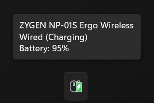

# Mouse Battery Monitor

System tray battery monitor for Endgame Gear and VAXEE wireless mice.



## Features

- Real-time battery percentage display in system tray
- Supports Endgame Gear and VAXEE wireless mice
- Customizable PNG icons for different battery levels
- Low battery notifications
- Configurable update interval
- Minimal resource usage

## Prerequisites
<>
### Installing Tools with Scoop

If you don't have the build tools installed, you can use [Scoop](https://scoop.sh/) to install them:

```powershell
# Install MinGW (includes GCC)
scoop install gcc

# Install Make
scoop install make
```

## Building

Requires GCC/MinGW with C++17 support.

```bash
make
```

Build with debug mode (shows console):
```bash
make DEBUG=1
```

The application runs in the system tray. Right-click the icon for options.

## Configuration

Edit `config.ini`:

- `update_interval_seconds` - How often to check battery (default: 300 seconds)
- `show_notifications` - Enable/disable notifications (default: true)
- `low_battery_threshold` - Battery % for low warning (default: 20%)
- `debug_mode` - Show console window and verbose logging (default: false)

## Supported Devices

### Endgame Gear

| Device             | VID    | PID    | Connection |
| ------------------ | ------ | ------ | ---------- |
| Wireless Dongle    | 0x3367 | 0x1970 | Wireless   |
| OP1W               | 0x3367 | 0x1972 | Wired USB  |
| XM2W v2            | 0x3367 | 0x1982 | Wired USB  |

### VAXEE (Dongles)

| Device                        | VID    | PID    |
| ----------------------------- | ------ | ------ |
| VAXEE Dongle                  | 0x3057 | 0x1001 |
| VAXEE 4K Dongle               | 0x3057 | 0x1002 |
| VAXEE Dongle                  | 0x3057 | 0x0005 |
| VAXEE 4K Dongle (Dual-track)  | 0x3057 | 0x2001 |

### VAXEE (Mice - Direct USB)

| Device                          | VID    | PID    |
| ------------------------------- | ------ | ------ |
| VAXEE XE Wireless               | 0x3057 | 0x1003 |
| ZYGEN NP-01S Wireless           | 0x3057 | 0x1004 |
| VAXEE AX Wireless               | 0x3057 | 0x1005 |
| ZYGEN NP-01 Wireless            | 0x3057 | 0x1006 |
| VAXEE XE-S Wireless             | 0x3057 | 0x1007 |
| VAXEE XE-S-L Wireless           | 0x3057 | 0x1008 |
| VAXEE x NINJUTSO Sora Wireless  | 0x3057 | 0x1009 |
| VAXEE E1 Wireless               | 0x3057 | 0x1010 |
| ZYGEN NP-01S V2 Wireless        | 0x3057 | 0x1011 |
| VAXEE XE V2 Wireless            | 0x3057 | 0x1012 |
| ZYGEN NP-01S Ergo Wireless      | 0x3057 | 0x1013 |

For protocol details, see [docs/ENDGAME.md](docs/ENDGAME.md) and [docs/VAXEE.md](docs/VAXEE.md).

## Development

Build targets:
- `make` - Build release version (always clean build)
- `make DEBUG=1` - Build debug version
- `make clean` - Clean build artifacts
- `make run` - Build and run
- `make help` - Show all targets

## License

This project is licensed under the MIT License - see the [LICENSE](LICENSE) file for details.

Icons are from the Bitsies icon pack by Recep Kutuk, licensed under CC BY 4.0 - see [ATTRIBUTION.md](ATTRIBUTION.md) for details.
