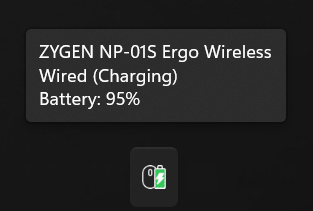

# Mouse Battery Monitor

System tray battery monitor for Endgame Gear and VAXEE wireless mice. Runs on Windows and Linux.



## Features

- Real-time battery percentage display in system tray
- Supports Endgame Gear and VAXEE wireless mice
- Customizable PNG icons for different battery levels
- Low battery notifications
- Instant refresh when a dongle or cable is plugged or unplugged
- Configurable update interval
- Minimal resource usage

## Windows

### Prerequisites

If you don't have the build tools installed, you can use [Scoop](https://scoop.sh/) to install them:

```powershell
# Install MinGW (includes GCC)
scoop install gcc

# Install Make
scoop install make
```

### Building

Requires GCC/MinGW with C++17 support.

```bash
make
```

Build with debug mode (console subsystem instead of a windowed app):
```bash
make DEBUG=1
```

The application runs in the system tray. Right-click the icon for options.

## Linux

Needs a C++17 compiler, Qt 6 Widgets (for the StatusNotifierItem tray icon) and libudev (for hotplug detection). Battery reads go through `hidraw`.

### Prerequisites

| Distro         | Packages                             |
| -------------- | ------------------------------------ |
| Arch           | `base-devel qt6-base systemd-libs`   |
| Debian/Ubuntu  | `build-essential qt6-base-dev libudev-dev` |
| Fedora         | `gcc-c++ make qt6-qtbase-devel systemd-devel` |

`make deps` reports anything missing.

### Arch, CachyOS and derivatives

A PKGBUILD is provided, which handles the udev rule, the desktop entry and the systemd user unit for you:

```bash
cd packaging/arch
makepkg -si
```

Then start it with `systemctl --user enable --now mouse-battery-monitor.service`. Replug the device once afterwards so the new udev rule applies to it.

### Building and installing manually

```bash
make
sudo make install PREFIX=/usr
sudo make install-udev-rules
```

`/dev/hidraw*` is root-only by default, so the udev rules step is required — without it the monitor reports "No device connected". The rule tags the Endgame Gear and VAXEE HID nodes with `uaccess`, which grants access to the logged-in desktop user. Replug the device (or run `sudo udevadm trigger --subsystem-match=hidraw --action=change`) afterwards.

Running from the build tree works too — resources and `config.ini` are copied next to the binary:

```bash
./build/release/mouse-battery-monitor
```

### Command line

```
mouse-battery-monitor            # run the tray icon
mouse-battery-monitor --once     # print status once and exit (for status bars)
mouse-battery-monitor --debug    # verbose logging to stdout and the log file
mouse-battery-monitor --version
```

### Autostart

Either enable the installed systemd user unit:

```bash
systemctl --user enable --now mouse-battery-monitor.service
```

or let the desktop autostart it:

```bash
mkdir -p ~/.config/autostart
cp /usr/share/applications/mouse-battery-monitor.desktop ~/.config/autostart/
```

Enabling both is harmless — tray mode holds an exclusive lock, so a second instance reports the running pid and exits quietly instead of adding a duplicate icon.

On GNOME the tray icon needs an AppIndicator extension; KDE Plasma, XFCE, Waybar and other StatusNotifierItem hosts work out of the box.

See [docs/LINUX.md](docs/LINUX.md) for troubleshooting.

## Configuration

Edit `config.ini` — on Windows next to the executable, on Linux at `~/.config/mouse-battery-monitor/config.ini` (falling back to the file next to the binary). `MBM_CONFIG` overrides the location.

- `update_interval_seconds` - How often to check battery (default: 300 seconds)
- `show_notifications` - Enable/disable notifications (default: true)
- `low_battery_threshold` - Battery % for low warning (default: 20%)
- `debug_mode` - Verbose logging to stdout and the log file (default: false)

Logs go to `battery_monitor.log` in the working directory on Windows (normally the folder the executable was started from), and to `~/.local/state/mouse-battery-monitor/battery_monitor.log` on Linux.

## Supported Devices

### Endgame Gear

| Device             | VID    | PID    | Connection |
| ------------------ | ------ | ------ | ---------- |
| XM2w 4K V1         | 0x3367 | 0x1968 | Wired USB  |
| Wireless Dongle    | 0x3367 | 0x1970 | Wireless   |
| OP1W               | 0x3367 | 0x1972 | Wired USB  |
| XM2W v2            | 0x3367 | 0x1982 | Wired USB  |

### VAXEE (Dongles)

| Device                        | VID    | PID    |
| ----------------------------- | ------ | ------ |
| VAXEE Dongle                  | 0x3057 | 0x1001 |
| VAXEE 4K Dongle               | 0x3057 | 0x1002 |
| VAXEE Dongle                  | 0x3057 | 0x0005 |
| VAXEE 4K Dongle (Dual-track)  | 0x3057 | 0x2001 |

### VAXEE (Mice - Direct USB)

| Device                          | VID    | PID    |
| ------------------------------- | ------ | ------ |
| VAXEE XE Wireless               | 0x3057 | 0x1003 |
| ZYGEN NP-01S Wireless           | 0x3057 | 0x1004 |
| VAXEE AX Wireless               | 0x3057 | 0x1005 |
| ZYGEN NP-01 Wireless            | 0x3057 | 0x1006 |
| VAXEE XE-S Wireless             | 0x3057 | 0x1007 |
| VAXEE XE-S-L Wireless           | 0x3057 | 0x1008 |
| VAXEE x NINJUTSO Sora Wireless  | 0x3057 | 0x1009 |
| VAXEE E1 Wireless               | 0x3057 | 0x1010 |
| ZYGEN NP-01S V2 Wireless        | 0x3057 | 0x1011 |
| VAXEE XE V2 Wireless            | 0x3057 | 0x1012 |
| ZYGEN NP-01S Ergo Wireless      | 0x3057 | 0x1013 |

For protocol details, see [docs/ENDGAME.md](docs/ENDGAME.md) and [docs/VAXEE.md](docs/VAXEE.md).

## Development

Build targets:
- `make` - Build release version (always clean build)
- `make build` - Build without cleaning first
- `make DEBUG=1` - Build debug version
- `make clean` - Clean build artifacts
- `make run` - Build and run
- `make deps` - Check build dependencies (Linux)
- `make format` / `make format-check` - Rewrite / verify formatting with clang-format
- `make lint` - clang-tidy and cppcheck, warnings are errors (Linux)
- `make install` / `make uninstall` - Install under `PREFIX` (Linux)
- `make install-udev-rules` - Install HID access rules (Linux, needs root)
- `make help` - Show all targets

Style is enforced by `.clang-format` and `.clang-tidy`; CI runs `format-check`, the Linux build and `lint` before anything is released.

The Makefile picks the platform automatically. To build the Windows binary from Linux (useful for checking that shared changes still compile), install a MinGW-w64 toolchain and override the platform:

```bash
make PLATFORM=windows CXX=x86_64-w64-mingw32-g++ WINDRES=x86_64-w64-mingw32-windres
```

Note that the resulting `.exe` is not a usable way to run this on Linux — see [docs/LINUX.md](docs/LINUX.md#why-not-just-run-the-windows-build-under-wine).

Shared code (device protocols, polling state machine, config, logging) is platform-neutral; the Windows and Linux backends sit behind small dispatch headers:

| Concern      | Windows                    | Linux                        |
| ------------ | -------------------------- | ---------------------------- |
| HID access   | `hid.dll` + SetupAPI       | `hidraw` ioctls              |
| Tray icon    | `Shell_NotifyIcon`         | Qt 6 `QSystemTrayIcon` (SNI) |
| Hotplug      | `WM_DEVICECHANGE`          | libudev monitor              |
| Event loop   | Win32 message loop         | Qt event loop                |
| Entry point  | `src/main_win32.cpp`       | `src/main_linux.cpp`         |

## License

This project is licensed under the MIT License - see the [LICENSE](LICENSE) file for details.

Icons are from the Bitsies icon pack by Recep Kutuk, licensed under CC BY 4.0 - see [ATTRIBUTION.md](ATTRIBUTION.md) for details.
